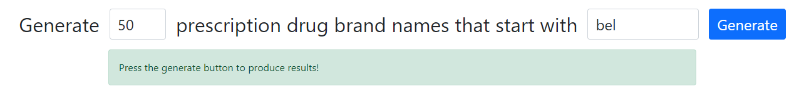

# RX-Name-Generator

## Overview

The brand names for prescription drugs in the United States are oftentimes outlandish and entertaining, but anyone who watches enough US professional sports (or any other target demographic of the pharmaceutical industry), where TV ads for prescription drugs run rampant, will recognize the seeming regularity of their structure and sound. Generally, when a new pharma ad airs on TV, the brand they are promoting certainly <i>sounds</i> like a prescription drug. Why is that? How do the companies generate these names? Unsurprisingly, it seems to be a [long-winded marketing process](https://www.pfizer.com/news/articles/part_2_what_s_in_a_brand_name_how_drugs_get_their_names). 

This project explores using a neural network to learn the patterns in the now fairly substantive dataset of prescription drug names, and use them to generate new ones. Specifically, it employs a popular type of recurrent neural net, a <i>Long Short-Term Memory (LSTM)</i> network, to take a variable length seed string and generate a new name starting with that seed.

While this may represent an efficient way for pharma companies to generate new candidate names, it is mostly just an excuse to generate funny sounding names using math (does one really even need an excuse?).

## Getting Started

### Dependencies

This project was built using Python 3.10.6, and a number of popular external libraries:
- BeautifulSoup4
- Numpy
- PyTorch
- Dash
- Plotly

The specific version of each installed package can be found in `requirements.txt`. Any Python environment with these packages will be able to run the code, as long as the versions are the same (the code may work for other Python/package versions, but they have not been tested). For example, one could install the packages to a virtual environment using `pip` with the command `pip install -r requirements.txt`. [Anaconda](https://www.anaconda.com/) is another alternative which may be preferable since it will ensure any non-Python dependencies are also installed.

### Usage

All code is meant to be executed using a command line from the root directory of this repository. For example, to run the web application, use `python web/app.py`.

## Subsection Descriptions
### Data

Existing prescription drug names for training the model were scraped from the web using BeautifulSoup4. The two sites that were scraped were [RxAssist.org](https://www.rxassist.org/) and [RxList.com](https://www.rxlist.com/). The file `data/scrape.py` handles all web scraping and stores results in the `data/raw` directory.

The data was cleaned (removal of duplicates, problematic characters, etc.) using `data/clean.ipynb`. 

After all data processing the training set size for the model is 3601 names.

### Model

This model treats each name in the dataset as a sequence of one-hot encoded letters. Recurrent neural networks excel with sequence data since their backwards connections allow them to incorporate previous states or outputs of the model in new predictions. 

LSTMs are a specific type of recurrent neural network characterized by the inclusion of one or more "LSTM cells", which are specifically designed combinations of nodes and activation functions that allow the model to maintain a state of information called the "cell state", which informs predictions. At each step (letter) in the sequence, the model selects what information to retain in the cell state and what information to add to the cell state. This decision is informed by the newest input letter to the sequence as well as the previous state of the cell.

In this model architecture, the goal is to predict the next letter in the sequence, so one or more LSTM cells is followed by a 27-node linear output layer, for the 26 letters in the English alphabet plus a space character, which will encode the end of the word. This structure combined with the cross entropy loss function allows the model to output the probability (in log-odds form) of each letter being next in the sequence. During name generation, the model generates a new distribution of probabilities for each new letter, and the actual letter to be used is selected from this distribution.

The model is implemented using [PyTorch](https://pytorch.org/). All model definition, including for training and prediction functions/methods, is done in `models/lstm.py`. Executing this file directly trains an instance of this model using hyperparameters that can be edited in the code, and saves the trained model state to the `models/trained` directory. Simple test predictions from a trained model can be generated using `models/test.py`.
- `models/utils.py` only contains function definitions for encoding and padding the variable length sequences, and is not meant to be executed

### Web App

The web app portion of this project is meant to provide an easy way to explore the predictions generated by the model. It was built using [Dash](https://dash.plotly.com/) and styled using [Bootstrap 5](https://getbootstrap.com/). The overall layout of the site is defined in `app/layout.py` (not meant to be executed), while the rest of the app is defined and run with `models/app.py`. After executing this file the web app will be available on the local server at port 8050.

The app is divided into two simple sections. The topmost section of the app takes in user input regarding the number of names to generate and the seed string:

Invalid inputs will render the button disabled, and the dialog box instructs users on supplying valid inputs. When acceptable inputs are supplied and the button is pressed, the next section gets populated with results:

The first subsection in the top left displays 3 generated names at a time and allows the user to navigate through all generated names. The subsection in the top right describes some additional information about the model outputs, including the number of unique words generated and the theoretical most likely word given the inputs. The bottom section contains two tabs, each of which contains a bar chart showcasing the empirical distribution of model results from this generation batch, first from the name level (so that the user may compare the distribution of generated names to the theoretical most likely name), as well as from the letter level (shown above).

## Potential Improvements

There are a number of ways this project could be extended/improved. They are perhaps best organized according to their subsection:

<b>Data</b>
- Expand the dataset by:
    - Finding and scraping additional sites
    - Adding one-off names as they are encountered (for example, on a TV ad)
- Further clean the data to ensure no generic drug names are included, or other nonsensical strings

<b>Model</b>
- Experiment with different hyperparameter choices and model sizes
- Try different RNN variants, like a Gated Recurrent Unit (GRU)
- Develop a complementary model that generates visual branding given a generated drug name

<b>Web App</b>
- Improve formatting for different sized windows
- Develop a visualization showcasing the similarity of each generated name to all others
    - Different metrics for string similarity are possible
